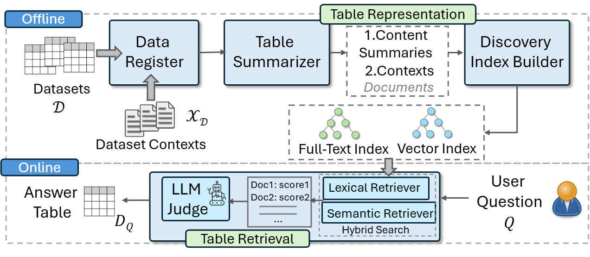

# Pneuma
[](https://colab.research.google.com/github/TheDataStation/Pneuma/blob/main/quickstart-colab.ipynb)

`Pneuma` is an LLM-powered data discovery system for tabular data. Given a natural language query,
`Pneuma` searches an indexed collection and retrieves the most relevant tables for the question. It performs this search by leveraging both **content** (columns and rows) and **context** (metadata) to match tables with questions.


## Getting Started

If you would like to try `Pneuma` without installation, you can use our [Colab notebook](https://colab.research.google.com/github/TheDataStation/Pneuma/blob/main/quickstart.ipynb). For local installation, you will need a **GPU with at least 20 GB of VRAM** to load and prompt both the LLM and embedding model. Support for third-party APIs such as OpenAI is currently a work in progress (WIP).

### Local Installation

To ensure smooth installation and usage, we **strongly recommend** installing `Miniconda` (follow [this](https://docs.anaconda.com/miniconda/install/)). Then, create a new environment and install the CUDA Toolkit:

```bash
$ conda create --name pneuma python=3.12.2 -y
$ conda activate pneuma
$ conda install -c nvidia cuda-toolkit -y
```

To install the latest stable release from PyPI:

```bash
$ pip install pneuma
```

To install the most recent version from the repository:

```bash
$ git clone https://github.com/TheDataStation/Pneuma.git
$ cd Pneuma
$ pip install -r requirements.txt
```

## Quick Start

The simplest way to explore `Pneuma` is by running the [quickstart Jupyter notebook](quickstart.ipynb). This notebook walks you through `Pneuma`'s full workflow, from **data registration** to **querying**. For those eager to dive in, here’s a snippet showcasing its functionality:

```python
from pneuma import Pneuma

# Initialize Pneuma
out_path = "out_demo/storage"
pneuma = Pneuma(
    out_path=out_path,
    llm_path="Qwen/Qwen2.5-7B-Instruct",
    embed_path="BAAI/bge-base-en-v1.5",
)
pneuma.setup()

# Register dataset & summarize it
data_path = "data_src/sample_data/csv"
pneuma.add_tables(path=data_path, creator="demo_user")
pneuma.summarize()

# Add context (metadata) if available
metadata_path = "data_src/sample_data/metadata.csv"
pneuma.add_metadata(metadata_path=metadata_path)

# Generate index
pneuma.generate_index(index_name="demo_index")

# Query the index
response = pneuma.query_index(
    index_name="demo_index",
    query="Which dataset contains climate issues?",
    k=1,
    n=5,
    alpha=0.5,
)
response = json.loads(response)
query = response["data"]["query"]
retrieved_tables = response["data"]["response"]
```

## Pneuma's CLI

To use `Pneuma` via the command line, refer to the [CLI reference documentation](pneuma/cli.md) for detailed instructions.
